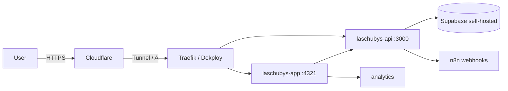

# Las Chubys Production Readiness — Implementation Plan

> **For agentic workers:** REQUIRED SUB-SKILL: Use `superpowers:subagent-driven-development` to implement this plan task-by-task. Steps use checkbox (`- [ ]`) syntax for tracking.

**Goal:** Dejar la infraestructura y el código de Las Chubys listos para producción a fin de mes: tests, límites de recursos, RLS auditado, smoke tests, observabilidad, runbooks y hardening de rate limits.

**Architecture:** Trabajamos en los repos `LasChubys-Front` y `LasChubys-Back` (rama `develop` / feature branches), ajustamos contenedores en el VPS vía SSH, y configuramos workflows en n8n. Todo se documenta en el vault.

**Tech Stack:** Angular 21 SSR, NestJS 11, Bun, Supabase self-hosted, Dokploy (Docker Swarm), n8n, Cloudflare, Uptime Kuma, Telegram.

## Global Constraints

- **Runtime backend:** Node (`node dist/main`), aunque usamos `bun` para install/scripts.
- **Package manager:** Bun `1.3.14` (`bun.lockb`).
- **Rama base:** `develop` para features; merge local a `develop`, luego TRIN empuja/pide PR a `main`.
- **0 secretos en archivos `.md` del vault o en código.** Usar referencias Bitwarden.
- **Tests obligatorios:** todo cambio de código debe incluir/correr tests.
- **Modo ultra-directo:** sin relleno, sin cortesías, commits en español/inglés según convención del repo.
- **Nunca push directo a `main` ni `develop`.**

---

## Task 1: Backend testing setup + CI

**Files:**
- Create: `Las Chubys/LasChubys-Back/jest.config.js`, `Las Chubys/LasChubys-Back/src/modules/health/health.controller.spec.ts`, `Las Chubys/LasChubys-Back/src/modules/contact/contact.controller.spec.ts`, `Las Chubys/LasChubys-Back/src/modules/checkout/checkout.controller.spec.ts`
- Modify: `Las Chubys/LasChubys-Back/package.json`, `Las Chubys/LasChubys-Back/.github/workflows/ci.yml`, `Las Chubys/LasChubys-Back/tsconfig.json`

**Interfaces:**
- Consumes: `SupabaseService` (`admin`/`anon` clients), `ContactService`, `CheckoutService`, DTOs `CreateContactDto`, `CreateOrderDto`.
- Produces: suite de tests ejecutable en CI.

- [ ] **Step 1: Instalar dependencias de test**

```bash
cd "Las Chubys/LasChubys-Back"
bun add -d jest @nestjs/testing supertest @types/jest @types/supertest ts-jest
```

- [ ] **Step 2: Crear `jest.config.js`**

```js
module.exports = {
  moduleFileExtensions: ['js', 'json', 'ts'],
  rootDir: 'src',
  testRegex: '.*\\.spec\\.ts$',
  transform: { '^.+\\.(t|j)s$': 'ts-jest' },
  collectCoverageFrom: ['**/*.(t|j)s'],
  coverageDirectory: '../coverage',
  testEnvironment: 'node',
};
```

- [ ] **Step 3: Añadir scripts en `package.json`**

```json
"test": "jest",
"test:watch": "jest --watch",
"test:cov": "jest --coverage"
```

- [ ] **Step 4: Escribir tests mínimos críticos**

`src/modules/health/health.controller.spec.ts`:
```ts
import { Test } from '@nestjs/testing';
import { HealthController } from './health.controller';
import { SupabaseService } from '../supabase/supabase.service';

describe('HealthController', () => {
  let controller: HealthController;
  const mockSupabase = { admin: { from: jest.fn() } };

  beforeEach(async () => {
    const module = await Test.createTestingModule({
      controllers: [HealthController],
      providers: [{ provide: SupabaseService, useValue: mockSupabase }],
    }).compile();
    controller = module.get(HealthController);
  });

  it('returns ok when supabase query succeeds', async () => {
    mockSupabase.admin.from.mockReturnValue({
      select: jest.fn().mockReturnValue({ limit: jest.fn().mockResolvedValue({ error: null }) }),
    });
    expect(await controller.check()).toEqual({ status: 'ok' });
  });

  it('returns degraded when supabase query fails', async () => {
    mockSupabase.admin.from.mockReturnValue({
      select: jest.fn().mockReturnValue({ limit: jest.fn().mockResolvedValue({ error: { message: 'fail' } }) }),
    });
    expect(await controller.check()).toEqual({ status: 'degraded', detail: 'fail' });
  });
});
```

`src/modules/contact/contact.controller.spec.ts`:
```ts
import { Test } from '@nestjs/testing';
import request from 'supertest';
import { INestApplication } from '@nestjs/common';
import { ContactController } from './contact.controller';
import { ContactService } from './contact.service';
import { CsrfGuard } from '../../shared/csrf/csrf.guard';

describe('ContactController (e2e)', () => {
  let app: INestApplication;
  const mockService = { create: jest.fn() };

  beforeEach(async () => {
    const module = await Test.createTestingModule({
      controllers: [ContactController],
      providers: [{ provide: ContactService, useValue: mockService }],
    })
      .overrideGuard(CsrfGuard)
      .useValue({ canActivate: () => true })
      .compile();
    app = module.createNestApplication();
    await app.init();
  });

  afterEach(async () => await app.close());

  it('POST /contact returns 201 on valid dto', () => {
    mockService.create.mockResolvedValue({ ok: true, contactId: '1' });
    return request(app.getHttpServer())
      .post('/contact')
      .send({ name: 'Ana', email: 'ana@test.com', message: 'Hola' })
      .expect(201)
      .expect({ ok: true, contactId: '1' });
  });

  it('POST /contact returns 400 on invalid dto', () => {
    return request(app.getHttpServer())
      .post('/contact')
      .send({ email: 'no-valid' })
      .expect(400);
  });
});
```

`src/modules/checkout/checkout.controller.spec.ts`:
```ts
import { Test } from '@nestjs/testing';
import request from 'supertest';
import { INestApplication } from '@nestjs/common';
import { CheckoutController } from './checkout.controller';
import { CheckoutService } from './checkout.service';
import { CsrfGuard } from '../../shared/csrf/csrf.guard';

describe('CheckoutController (e2e)', () => {
  let app: INestApplication;
  const mockService = { createOrder: jest.fn() };
  const validOrder = {
    customer: { name: 'Ana', phone: '099', email: 'ana@test.com', province: 'Pichincha', address: 'Calle 1' },
    items: [{ id: 'p1', name: 'Arena', qty: 1, price: 10 }],
    total: 10,
  };

  beforeEach(async () => {
    const module = await Test.createTestingModule({
      controllers: [CheckoutController],
      providers: [{ provide: CheckoutService, useValue: mockService }],
    })
      .overrideGuard(CsrfGuard)
      .useValue({ canActivate: () => true })
      .compile();
    app = module.createNestApplication();
    await app.init();
  });

  afterEach(async () => await app.close());

  it('POST /checkout creates order', () => {
    mockService.createOrder.mockResolvedValue({ ok: true, orderId: 'o1' });
    return request(app.getHttpServer())
      .post('/checkout')
      .send(validOrder)
      .expect(201)
      .expect({ ok: true, orderId: 'o1' });
  });

  it('POST /checkout returns 400 on invalid order', () => {
    return request(app.getHttpServer()).post('/checkout').send({}).expect(400);
  });
});
```

- [ ] **Step 5: Actualizar CI para correr tests**

En `.github/workflows/ci.yml`, añadir paso después de `typecheck`:

```yaml
      - name: Test
        run: bun run test
```

- [ ] **Step 6: Correr tests local y en CI**

```bash
bun run test
```

- [ ] **Step 7: Commit**

```bash
git add .
git commit -m "test(back): add jest setup + health/contact/checkout specs and run in CI"
```

---

## Task 2: Frontend CI tests

**Files:**
- Modify: `Las Chubys/LasChubys-Front/package.json`, `Las Chubys/LasChubys-Front/.github/workflows/ci.yml`

- [ ] **Step 1: Añadir script `test:ci`**

```json
"test:ci": "ng test --watch=false"
```

- [ ] **Step 2: Añadir paso de test en CI**

```yaml
      - name: Test
        run: bun run test:ci
```

- [ ] **Step 3: Verificar que `ng test` pasa**

```bash
bun run test:ci
```

- [ ] **Step 4: Commit**

```bash
git commit -m "ci(front): run unit tests in CI"
```

---

## Task 3: Resource limits + restart policies en contenedores

**Files:**
- Create: `vault/laschubys/20-Tech/Resource-Limits.md`
- Modify: contenedores en VPS vía SSH (documentar comandos)

**Interfaces:**
- Consumes: nombres de servicios/contenedores en VPS.
- Produces: contenedores con límites de memoria/CPU y política de reinicio.

- [ ] **Step 1: Aplicar límites a servicios Swarm de Las Chubys**

```bash
ssh -i ~/.ssh/id_ed25519 root@100.105.133.25 '
  docker service update \
    --limit-memory 512M --limit-cpu 1.0 \
    --reserve-memory 128M --reserve-cpu 0.25 \
    --restart-condition any \
    laschubys-app-16uema

  docker service update \
    --limit-memory 512M --limit-cpu 1.0 \
    --reserve-memory 128M --reserve-cpu 0.25 \
    --restart-condition any \
    laschubys-api-b9k60b
'
```

- [ ] **Step 2: Aplicar límites a contenedores clave de infra (Docker Compose / standalone)**

```bash
ssh -i ~/.ssh/id_ed25519 root@100.105.133.25 '
  docker update --memory 2g --memory-swap 2g --cpus 1.0 supabase-db || true
  docker update --memory 1g --memory-swap 1g --cpus 0.5 n8n || true
  docker update --memory 256m --memory-swap 256m --cpus 0.25 uptime-kuma || true
'
```

- [ ] **Step 3: Verificar límites aplicados**

```bash
ssh -i ~/.ssh/id_ed25519 root@100.105.133.25 '
  docker service inspect --format "{{.Name}} mem={{.Spec.TaskTemplate.Resources.Limits.MemoryBytes}} cpu={{.Spec.TaskTemplate.Resources.Limits.NanoCPUs}}" laschubys-app-16uema laschubys-api-b9k60b
  docker inspect --format "{{.Name}} mem={{.HostConfig.Memory}} cpu={{.HostConfig.CpuQuota}}" supabase-db n8n uptime-kuma
'
```

- [ ] **Step 4: Documentar en vault**

Crear `vault/laschubys/20-Tech/Resource-Limits.md` con tabla de límites y comandos.

- [ ] **Step 5: Commit de docs (si aplica)**

---

## Task 4: RLS audit + fix `categories`

**Files:**
- Modify: schema `laschubys` en Supabase (vía SQL)
- Create/Modify: `vault/laschubys/20-Tech/Supabase.md`

- [ ] **Step 1: Listar tablas sin RLS y políticas actuales**

```bash
ssh -i ~/.ssh/id_ed25519 root@100.105.133.25 '
  docker exec supabase-db psql -U supabase_admin -d postgres -c "
    SELECT schemaname, tablename, rowsecurity FROM pg_tables WHERE schemaname = '\''laschubys'\'';
  "
  docker exec supabase-db psql -U supabase_admin -d postgres -c "
    SELECT tablename, policyname, cmd, qual::text, with_check::text
    FROM pg_policies WHERE schemaname = '\''laschubys'\'' ORDER BY tablename, policyname;
  "
'
```

- [ ] **Step 2: Habilitar RLS en `categories` y crear políticas**

```sql
ALTER TABLE laschubys.categories ENABLE ROW LEVEL SECURITY;

CREATE POLICY lch_categories_select ON laschubys.categories
  FOR SELECT USING (true);

CREATE POLICY lch_categories_insert ON laschubys.categories
  FOR INSERT WITH CHECK (false); -- solo service_role/admin via bypassrls

CREATE POLICY lch_categories_update ON laschubys.categories
  FOR UPDATE USING (false) WITH CHECK (false);

CREATE POLICY lch_categories_delete ON laschubys.categories
  FOR DELETE USING (false);
```

> Nota: las operaciones de escritura en `categories` las hace el BFF con `service_role`, que tiene `bypassrls`; por eso `WITH CHECK (false)` para `anon`/`authenticated` es seguro.

- [ ] **Step 3: Revisar políticas restantes y corregir si hay errores**

Verificar que `profiles`, `comments`, `orders`, `contacts`, `products`, `blog_posts`, `social_metrics` tengan políticas acordes al resumen del subagente explore. Reportar discrepancias.

- [ ] **Step 4: Documentar RLS en vault**

Actualizar `vault/laschubys/20-Tech/Supabase.md` con la matriz de políticas final.

---

## Task 5: Smoke tests post-deploy en CI

**Files:**
- Create: `Las Chubys/LasChubys-Front/e2e/smoke.spec.ts`, `Las Chubys/LasChubys-Front/.github/workflows/smoke.yml`

- [ ] **Step 1: Crear spec de smoke contra producción**

`e2e/smoke.spec.ts`:
```ts
import { test, expect } from '@playwright/test';

test.describe('smoke production', () => {
  test('homepage loads', async ({ page }) => {
    const res = await page.goto('https://laschubys.com');
    expect(res?.status()).toBe(200);
    await expect(page.locator('body')).toBeVisible();
  });

  test('api health returns ok', async ({ request }) => {
    const res = await request.get('https://api.laschubys.com/api/health');
    expect(res.ok()).toBeTruthy();
    const body = await res.json();
    expect(body.status).toBe('ok');
  });

  test('sitemap.xml is valid', async ({ request }) => {
    const res = await request.get('https://api.laschubys.com/api/content/sitemap.xml');
    expect(res.ok()).toBeTruthy();
    const text = await res.text();
    expect(text).toContain('<?xml');
  });
});
```

- [ ] **Step 2: Crear workflow `smoke.yml`**

```yaml
name: Smoke Tests

on:
  workflow_run:
    workflows: [CI]
    types: [completed]
    branches: [main]

jobs:
  smoke:
    if: ${{ github.event.workflow_run.conclusion == 'success' }}
    runs-on: ubuntu-latest
    steps:
      - uses: actions/checkout@v4
      - uses: oven-sh/setup-bun@v2
        with:
          bun-version: 1.3.14
      - run: bun install --frozen-lockfile
      - run: bunx playwright install chromium
      - run: bun run e2e --project=chromium --grep @smoke || bunx playwright test e2e/smoke.spec.ts --project=chromium
        env:
          CI: true
```

- [ ] **Step 3: Commit**

```bash
git add .
git commit -m "test(front): add production smoke tests workflow"
```

---

## Task 6: Restore drill de backups

**Files:**
- Create: `vault/laschubys/10-Log/restore-drill-2026-07-12.md`

- [ ] **Step 1: Localizar último backup**

```bash
ssh -i ~/.ssh/id_ed25519 root@100.105.133.25 'ls -1t /opt/backups/supabase/laschubys-*.sql | head -1'
```

- [ ] **Step 2: Restaurar en contenedor temporal**

```bash
ssh -i ~/.ssh/id_ed25519 root@100.105.133.25 '
  BACKUP=$(ls -1t /opt/backups/supabase/laschubys-*.sql | head -1)
  docker run --rm --name laschubys-restore-drill \
    -e POSTGRES_USER=drill -e POSTGRES_PASSWORD=drill -e POSTGRES_DB=drill \
    -v /opt/backups/supabase:/backups:ro \
    -v laschubys-restore-drill-data:/var/lib/postgresql/data \
    postgres:16-alpine &
  sleep 10
  docker exec laschubys-restore-drill psql -U drill -d drill -f "/backups/$(basename $BACKUP)" > /tmp/restore.log 2>&1
  docker exec laschubys-restore-drill psql -U drill -d drill -c "SELECT schemaname, tablename, n_live_tup FROM pg_stat_user_tables WHERE schemaname = '\''laschubys'\'' ORDER BY n_live_tup DESC;"
  docker stop laschubys-restore-drill
  docker volume rm laschubys-restore-drill-data
'
```

- [ ] **Step 3: Documentar resultado en vault**

---

## Task 7: n8n workflow para notificaciones de contacto

**Files:**
- Create: workflow JSON export en `vault/laschubys/20-Tech/n8n/workflows/LCH-Contact-Notify.json`
- Modify: `Las Chubys/LasChubys-Back/.env.example` (si falta `N8N_WEBHOOK_URL`)

- [ ] **Step 1: Verificar que `N8N_WEBHOOK_URL` está en `.env.example` y Dokploy**

Añadir a `.env.example`:
```
N8N_WEBHOOK_URL=https://n8n.alvarodevrace.tech/webhook/lch-contact-notify
```

- [ ] **Step 2: Crear workflow JSON**

Workflow: Webhook (POST `/webhook/lch-contact-notify`) → Telegram (bot Las Chubys) con mensaje:

```
📩 Nuevo contacto Las Chubys
Nombre: {{ $json.name }}
Email: {{ $json.email }}
Mensaje: {{ $json.message }}
```

Guardar como JSON en `vault/laschubys/20-Tech/n8n/workflows/LCH-Contact-Notify.json`.

- [ ] **Step 3: Importar workflow a n8n vía API**

```bash
N8N_KEY=<from_bitwarden_global_n8n-api-key>
curl -s -X POST "https://n8n.alvarodevrace.tech/api/v1/workflows" \
  -H "X-N8N-API-KEY: $N8N_KEY" \
  -H "Content-Type: application/json" \
  -d @vault/laschubys/20-Tech/n8n/workflows/LCH-Contact-Notify.json
```

- [ ] **Step 4: Activar workflow y probar**

Hacer un POST de prueba al webhook y verificar mensaje Telegram.

---

## Task 8: Alerting de recursos vía n8n

**Files:**
- Create: `infra/vps/scripts/resource-check.sh`, `vault/infra/20-Tech/n8n/workflows/OPS-Resource-Alert.json`
- Modify: cron en VPS

- [ ] **Step 1: Crear script de chequeo en VPS**

`/opt/scripts/resource-check.sh`:
```bash
#!/bin/bash
set -e
WEBHOOK="https://n8n.alvarodevrace.tech/webhook/infra-resource-alert"
DISK_PCT=$(df / | awk 'NR==2 {gsub(/%/,"",$5); print $5}')
MEM_AVAIL_PCT=$(free | awk '/Mem:/ {printf "%.0f", $7/$2*100}')
LOAD_AVG=$(uptime | awk -F'load average:' '{print $2}' | awk '{print $1}' | tr -d ',')

if (( DISK_PCT > 80 )) || (( MEM_AVAIL_PCT < 10 )) || (( $(echo "$LOAD_AVG > 5" | bc -l) )); then
  curl -s -X POST "$WEBHOOK" \
    -H "Content-Type: application/json" \
    -d "{\"disk_pct\":$DISK_PCT,\"mem_avail_pct\":$MEM_AVAIL_PCT,\"load_avg\":$LOAD_AVG,\"host\":\"vps\"}"
fi
```

```bash
chmod +x /opt/scripts/resource-check.sh
```

- [ ] **Step 2: Crear workflow n8n `OPS / Infra / Resource Alert`**

Webhook `POST /webhook/infra-resource-alert` → Telegram AlvaroDevRace con mensaje:

```
⚠️ Alerta recurso VPS
Disco: {{ $json.disk_pct }}%
Mem disponible: {{ $json.mem_avail_pct }}%
Load avg: {{ $json.load_avg }}
```

- [ ] **Step 3: Añadir cron cada 5 minutos**

```bash
(crontab -l 2>/dev/null; echo "*/5 * * * * /opt/scripts/resource-check.sh") | crontab -
```

- [ ] **Step 4: Probar manualmente**

```bash
/opt/scripts/resource-check.sh
```

---

## Task 9: Rate limit en checkout + runbook + diagrama

**Files:**
- Modify: `Las Chubys/LasChubys-Back/src/modules/checkout/checkout.controller.ts`, `Las Chubys/LasChubys-Back/src/app.module.ts`
- Create: `vault/laschubys/20-Tech/RUNBOOK-LCH.md`, `vault/laschubys/20-Tech/Architecture.md`

- [ ] **Step 1: Añadir configuración `checkout` en ThrottlerModule**

En `src/app.module.ts`, dentro de `ThrottlerModule.forRoot([...])` añadir:

```ts
{ name: 'checkout', ttl: 60000, limit: 5 },
```

- [ ] **Step 2: Aplicar throttle en CheckoutController**

```ts
import { Throttle } from '@nestjs/throttler';

@Controller('checkout')
@UseGuards(CsrfGuard)
export class CheckoutController {
  @Post()
  @Throttle({ checkout: { limit: 5, ttl: 60000 } })
  async create(@Body() dto: CreateOrderDto) {
    return this.checkoutService.createOrder(dto);
  }
}
```

- [ ] **Step 3: Añadir test de rate limit (opcional)**

En `checkout.controller.spec.ts`, enviar 6 requests y verificar 429 en la sexta. Para el test se puede desactivar global guard o usar instancia real con throttle.

- [ ] **Step 4: Crear runbook Las Chubys**

`vault/laschubys/20-Tech/RUNBOOK-LCH.md` con secciones:
- Deploy fallido / rollback
- API devuelve 500
- Checkout no crea pedidos
- Contacto no llega
- Auth OAuth falla
- RLS 403

- [ ] **Step 5: Crear diagrama de arquitectura**

`vault/laschubys/20-Tech/Architecture.md` con diagrama Mermaid:



- [ ] **Step 6: Commit**

```bash
git commit -m "feat(back): add checkout rate limit and docs"
```

---

## Task 10: Dependabot config

**Files:**
- Create: `.github/dependabot.yml` en ambos repos

- [ ] **Step 1: Crear config en frontend**

`Las Chubys/LasChubys-Front/.github/dependabot.yml`:
```yaml
version: 2
updates:
  - package-ecosystem: npm
    directory: /
    schedule:
      interval: weekly
    open-pull-requests-limit: 5
    reviewers:
      - alvarodevrace
```

- [ ] **Step 2: Crear config en backend**

`Las Chubys/LasChubys-Back/.github/dependabot.yml`:
```yaml
version: 2
updates:
  - package-ecosystem: npm
    directory: /
    schedule:
      interval: weekly
    open-pull-requests-limit: 5
    reviewers:
      - alvarodevrace
```

- [ ] **Step 3: Commit**

---

## Task 11: Vault index + log + verificación final

**Files:**
- Modify: `vault/laschubys/00-Index/INDEX.md`, `vault/laschubys/10-Log/LOG.md`

- [ ] **Step 1: Actualizar `vault/laschubys/00-Index/INDEX.md`**

Añadir links a:
- `20-Tech/Resource-Limits.md`
- `20-Tech/RUNBOOK-LCH.md`
- `20-Tech/Architecture.md`
- `20-Tech/Supabase.md` (RLS actualizado)

- [ ] **Step 2: Añadir entrada en `vault/laschubys/10-Log/LOG.md`**

Entrada tipo:

```markdown
## [2026-07-12] KIMICO | Production readiness: tests, limits, RLS, smoke, alerting

**Agente:** KIMICO (TRIN/PIXEL/LINK)
**Tareas:**
- Tests backend con Jest + specs health/contact/checkout.
- CI frontend/backend ejecuta tests.
- Resource limits en contenedores Las Chubys e infra.
- RLS auditado; habilitado en `categories`.
- Smoke tests post-deploy con Playwright.
- Restore drill validado.
- Workflow n8n para notificaciones de contacto.
- Alerting de recursos VPS vía script cron + n8n.
- Rate limit en checkout.
- Runbook y diagrama de arquitectura.
- Dependabot configurado.
**Bloqueos:** Ninguno.
**Pendientes:** Portfolio (postergado).
```

- [ ] **Step 3: Vault lint**

Ejecutar `kimi-vault-lint` y corregir issues.

- [ ] **Step 4: Verificación final**

- CI frontend ✅
- CI backend ✅
- Contenedores con límites ✅
- RLS `categories` con políticas ✅
- n8n contact workflow activo ✅
- Smoke workflow presente ✅
- Resource alerting funcionando ✅

---

## Execution Handoff

Plan saved to `docs/superpowers/plans/2026-07-12-laschubys-production-readiness.md`.

Recommended execution mode: **Subagent-Driven** — fresh subagent per task area, review between tasks, fast iteration.
