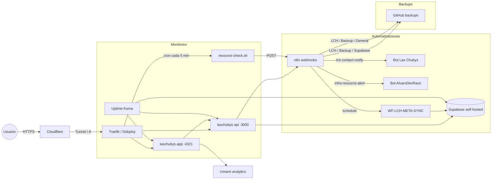

# Las Chubys — Arquitectura de Producción

Diagrama de alto nivel de la plataforma Las Chubys en producción.

## Diagrama

## Componentes

| Componente | Tecnología | Rol |
|---|---|---|
| **Frontend** | Angular 21 SSR | `laschubys-app`, puerto `4321` |
| **Backend** | NestJS 11 (BFF) | `laschubys-api`, puerto `3000` |
| **Base de datos** | Supabase self-hosted (Postgres 16) | Schema `laschubys` |
| **Proxy / Orquestador** | Traefik sobre Docker Swarm (Dokploy) | Enrutamiento TLS y deploys |
| **CDN / DNS / WAF** | Cloudflare | HTTPS, caching, rate limiting en `/api/auth/*` |
| **Automatización** | n8n | Webhooks, backups, sync Meta, alertas |
| **Monitoreo** | Uptime Kuma | Health checks y alertas Telegram |
| **Analytics** | Umami | Métricas de uso sin cookies de terceros |
| **Backups** | GitHub `alvarodevrace/laschubys-backups` | n8n + dumps Supabase |

## Flujos críticos

1. **Contacto:**
   - Usuario envía formulario → `App` → `POST /api/contact` → `ContactService` → webhook `lch-contact-notify` → n8n → Telegram bot Las Chubys.

2. **Checkout:**
   - Usuario confirma pedido → `POST /api/checkout` → `CheckoutService` → inserta `orders`/`order_items` en Supabase con `service_role`.
   - Rate limit: 5 pedidos/minuto por IP.

3. **Alertas de recurso:**
   - Cron en VPS ejecuta `resource-check.sh` cada 5 min.
   - Si disco >80%, mem disponible <10% o load >5, POST a `infra-resource-alert` → n8n → Telegram bot AlvaroDevRace.

4. **Sync métricas sociales:**
   - `WF-LCH-META-SYNC` corre diario a las 06:00 UTC → Meta Graph API → inserta en `laschubys.social_metrics`.

## Límites de recursos

Ver detalles en [Resource-Limits.md](Resource-Limits.md).

| Servicio | Mem límite | CPU límite |
|---|---|---|
| `laschubys-app-16uema` | 512 MB | 1.0 |
| `laschubys-api-b9k60b` | 512 MB | 1.0 |
| `supabase-db` | 2 GB | 1.0 |
| `n8n` | 1 GB | 0.5 |
| `uptime-kuma` | 256 MB | 0.25 |

## Seguridad

- RLS habilitado en todas las tablas del schema `laschubys`; ver matriz en [Supabase.md](Supabase.md).
- Auth OAuth con Google vía Supabase Auth + cookies `httpOnly`.
- Rate limiting en NestJS + WAF de Cloudflare en `/api/auth/*`.
- Secrets gestionados en Bitwarden; nunca en repositorios.
